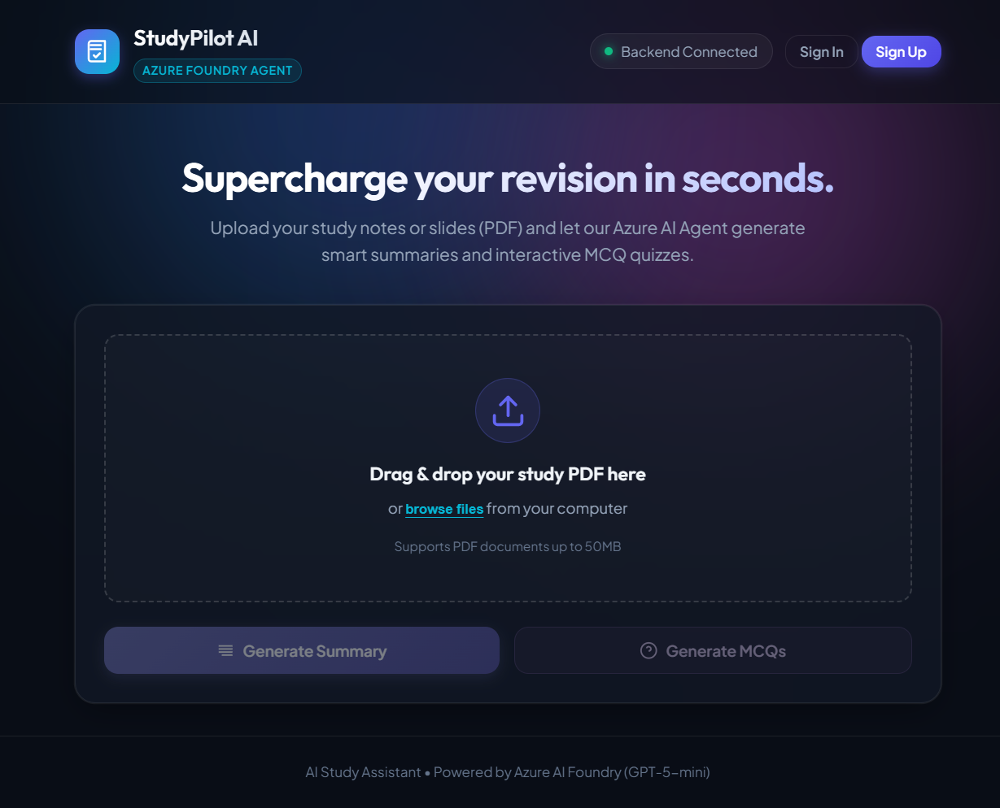
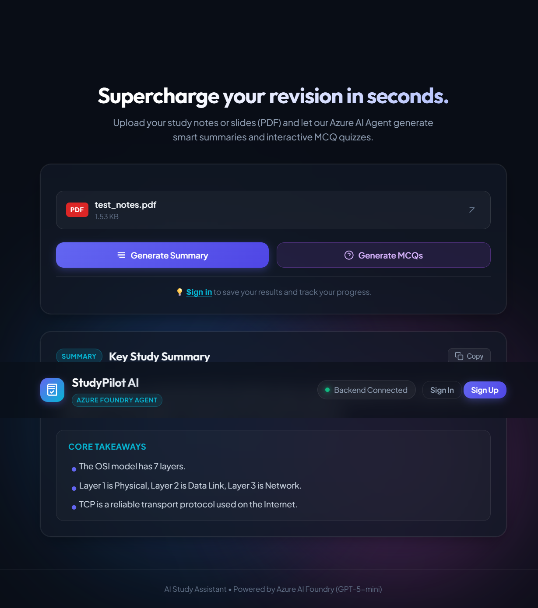
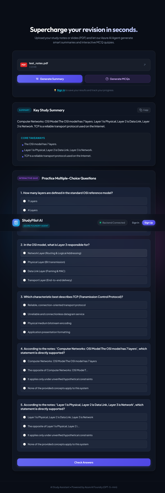

# LearnForge

## AI Study Assistant

> Turn your study PDFs into concise summaries and interactive MCQ quizzes with AI.

**AI Study Assistant** is a full-stack study companion that lets students upload lecture notes or other PDF study material and generate structured learning content using an **Azure AI Foundry agent**. Authenticated users can also save generated results, review study history, and track quiz performance.

## ✨ What it does

- 📄 **PDF upload** — Upload study notes and lecture material in PDF format.
- 🧠 **AI summaries** — Generate concise summaries focused on the supplied study material.
- 🎯 **Key points** — Extract the most important concepts for quick revision.
- ❓ **MCQ generation** — Generate 5 multiple-choice questions with 4 options each.
- 📝 **Interactive quizzes** — Answer generated questions and check your score.
- 👤 **Authentication** — Sign up and sign in with Supabase Auth.
- 🗂️ **Study history** — Save documents, summaries, MCQs, and quiz attempts for authenticated users.
- 📊 **Progress statistics** — View document count, generated results, quiz attempts, and average score.

## 🏗️ Architecture

The application follows a simple request pipeline:

```text
┌──────────────────┐
│   Web Frontend   │
│ HTML / CSS / JS  │
└────────┬─────────┘
         │
         │ multipart/form-data
         ▼
┌──────────────────┐
│   FastAPI API    │
│  Python Backend  │
└────────┬─────────┘
         │
         │ PDF + prompt
         ▼
┌──────────────────┐
│ Azure AI Foundry │
│  Study Agent     │
│   GPT-5-mini     │
└────────┬─────────┘
         │
         │ structured JSON
         ▼
┌──────────────────┐
│     Supabase     │
│ Auth + History   │
└──────────────────┘
```

### AI flow

```text
Student uploads PDF
       ↓
FastAPI receives file
       ↓
Azure AI Foundry processes the material
       ↓
AI Study Assistant agent generates:
   ├── Summary + key points
   └── MCQs + answers + explanations
       ↓
Backend returns structured JSON
       ↓
Frontend renders the result
       ↓
Authenticated results are stored in Supabase
```

## 🧰 Tech Stack

| Layer | Technology |
|---|---|
| Frontend | HTML5, CSS3, JavaScript |
| Backend | Python, FastAPI, Uvicorn |
| AI | Microsoft Azure AI Foundry |
| Model | GPT-5-mini |
| Authentication | Supabase Auth |
| Database | Supabase / PostgreSQL |
| Validation | Pydantic |
| Configuration | python-dotenv |

## 📁 Project Structure

```text
AI-Study-Assistant/
│
├── backend/
│   ├── app/
│   │   ├── main.py          # FastAPI routes and application entry point
│   │   ├── config.py        # Environment configuration
│   │   ├── foundry.py       # Azure AI Foundry integration
│   │   ├── models.py        # Pydantic models
│   │   └── database.py      # Supabase database operations
│   │
│   └── tests/               # Backend tests
│
├── frontend/
│   ├── index.html           # Main web application
│   ├── index.css            # UI styling
│   └── app.js               # Frontend logic and API integration
│
├── .env.example              # Environment variable template
├── .gitignore
├── requirements.txt          # Python dependencies
├── supabase_schema.sql       # Supabase database schema + RLS policies
├── FOUNDRY_HANDOVER.md       # Azure AI Foundry integration handover
└── README.md
```

## 🚀 Getting Started

### 1. Clone the repository

```bash
git clone https://github.com/Bhargav-bit567/AI-Study-Assistant.git
cd AI-Study-Assistant
```

### 2. Create a virtual environment

**Windows**

```bash
python -m venv .venv
.venv\Scripts\activate
```

**Linux / macOS**

```bash
python3 -m venv .venv
source .venv/bin/activate
```

### 3. Install dependencies

```bash
pip install -r requirements.txt
```

### 4. Configure environment variables

Create your local environment file:

```bash
cp .env.example .env
```

On Windows PowerShell:

```powershell
Copy-Item .env.example .env
```

Then configure the required Azure and Supabase values in `.env`.

### 5. Configure Supabase

Open the Supabase SQL Editor and run:

```text
supabase_schema.sql
```

The schema creates the required tables, authentication profile trigger, and Row Level Security policies for:

- user profiles
- uploaded documents
- generated results
- quiz attempts

### 6. Start the backend

```bash
uvicorn backend.app.main:app --reload --port 8000
```

The application will be available at:

```text
http://localhost:8000
```

Because the FastAPI application serves the `frontend/` directory, the same server can host the web interface.

## 🔐 Environment Variables

The application reads configuration from `.env`.

| Variable | Purpose |
|---|---|
| `AZURE_AI_ENDPOINT` | Azure AI Foundry project endpoint |
| `AZURE_OPENAI_ENDPOINT` | Azure OpenAI / Foundry Responses API endpoint |
| `AZURE_AI_API_KEY` | Azure API key used by the backend |
| `AZURE_MODEL_DEPLOYMENT` | Model deployment name, e.g. `gpt-5-mini` |
| `AZURE_AI_AGENT_NAME` | Foundry agent name |
| `AZURE_AI_AGENT_VERSION` | Foundry agent version |
| `SUPABASE_URL` | Supabase project URL |
| `SUPABASE_ANON_KEY` | Supabase anonymous/public key |
| `SUPABASE_SERVICE_ROLE_KEY` | Supabase server-side service-role key |

> **Security:** Never commit `.env`, API keys, service-role keys, or other secrets to Git. Keep privileged Supabase credentials on the backend only.

## 🔌 API Reference

### Health check

```http
GET /health
```

Example:

```bash
curl http://localhost:8000/health
```

Response:

```json
{
  "status": "ok"
}
```

### Generate a summary

```http
POST /api/study
Content-Type: multipart/form-data
```

Form fields:

```text
file=<study.pdf>
action=summary
```

Example:

```bash
curl -X POST http://localhost:8000/api/study \
  -F "file=@notes.pdf" \
  -F "action=summary"
```

### Generate MCQs

```bash
curl -X POST http://localhost:8000/api/study \
  -F "file=@notes.pdf" \
  -F "action=mcqs"
```

### Authentication

```http
POST /api/auth/signup
POST /api/auth/signin
```

### Study history

```http
GET  /api/history/documents
GET  /api/history/results
GET  /api/history/results/{result_id}
```

### Quiz tracking

```http
POST /api/history/quiz
GET  /api/history/quiz
GET  /api/stats
```

Authenticated endpoints expect:

```http
Authorization: Bearer <supabase_access_token>
```

## 📦 Response Format

The study endpoint returns structured JSON so the frontend does not need to parse free-form AI output.

### Summary response

```json
{
  "summary": "Concise explanation of the uploaded material.",
  "key_points": [
    "Important concept 1",
    "Important concept 2"
  ],
  "mcqs": [],
  "document_id": "uuid",
  "result_id": "uuid"
}
```

### MCQ response

```json
{
  "summary": "",
  "key_points": [],
  "mcqs": [
    {
      "question": "Which statement is correct?",
      "options": [
        "Option A",
        "Option B",
        "Option C",
        "Option D"
      ],
      "correct_answer": "Option B",
      "explanation": "Why option B is correct."
    }
  ],
  "document_id": "uuid",
  "result_id": "uuid"
}
```

## 🤖 Azure AI Foundry

The AI layer is built around an Azure AI Foundry agent named:

```text
AI-Study-Assistant
```

The project is configured to use **GPT-5-mini** and produces machine-readable JSON for summaries and MCQs.

The backend keeps the Azure integration isolated in:

```text
backend/app/foundry.py
```

For detailed Foundry integration notes, team responsibilities, testing guidance, and handover information, see **[FOUNDRY_HANDOVER.md](./FOUNDRY_HANDOVER.md)**.

## 💾 Data & Privacy Model

For authenticated users, the application stores:

```text
User
 ├── Documents
 │    └── Generated Results
 │          └── Quiz Attempts
 └── Statistics
```

Supabase Row Level Security policies are included in `supabase_schema.sql` so user-owned data is restricted to the corresponding authenticated user.

Unauthenticated users can generate study content, but results are not persisted to the user's history.

## 💡 Credit-Conscious Development

Azure resources may have limited credits. The project is designed to avoid unnecessary AI usage during development.

Recommended testing approach:

1. Use one small PDF.
2. Test one summary request.
3. Test one MCQ request.
4. Verify the complete frontend → backend → AI pipeline.
5. Avoid repeatedly regenerating identical results.

## 🛡️ Security Notes

- Keep all secrets in environment variables.
- Never expose `AZURE_AI_API_KEY` in frontend JavaScript.
- Never expose `SUPABASE_SERVICE_ROLE_KEY` to the browser.
- Use the Supabase access token for authenticated API calls.
- Keep user data scoped to the authenticated user.
- Do not commit production credentials or private configuration files.

## 🧪 Testing

Backend tests live under:

```text
backend/tests/
```

Run the API locally and verify at minimum:

```text
GET  /health
POST /api/auth/signup
POST /api/auth/signin
POST /api/study
GET  /api/history/results
POST /api/history/quiz
GET  /api/stats
```

## 🛣️ Roadmap

Potential future improvements include:

- Support for additional document formats such as PPTX and DOCX
- More study modes such as flashcards and short-answer questions
- Better personalization based on previous quiz performance
- Document-level caching to reduce repeated AI calls
- Improved automated testing and CI
- Production-grade observability and error tracking
- More granular document / vector-store isolation for multi-user deployments

## 🤝 Contributing

Contributions are welcome.

A clean workflow for team development is:

```text
feature branch
    ↓
implement
    ↓
test locally
    ↓
pull request
    ↓
review
    ↓
merge into main
```

Please avoid pushing unfinished experimental changes directly to `main`.

## 📄 License

No license file is currently included in the repository. Until a license is added, the project should not be assumed to grant broad reuse or redistribution rights.

---

<p align="center">
  Built with ❤️ using FastAPI, Supabase, and Azure AI Foundry.
</p>

## 🖥️ Screenshots

### Index: upload study material



### Generated study summary



### Interactive MCQ quiz


